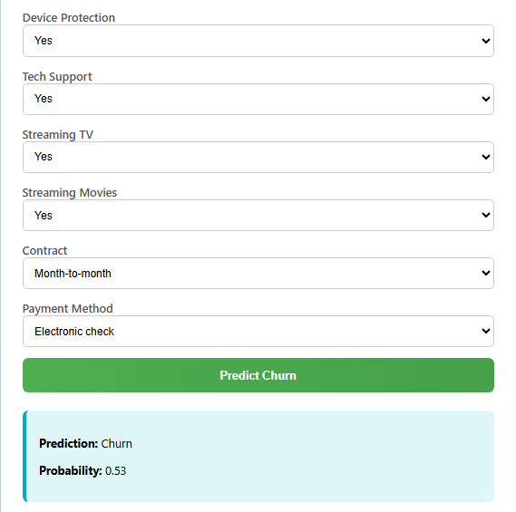
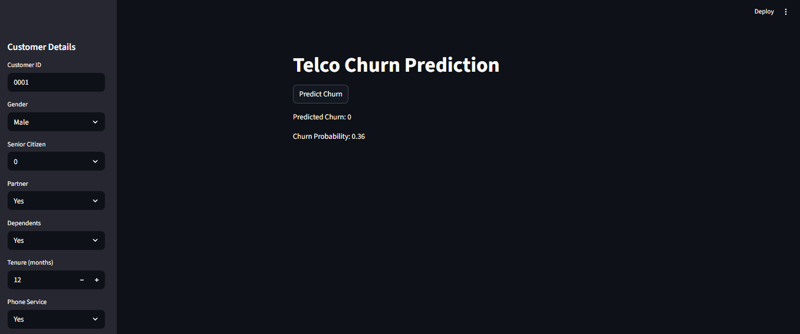

# Telco Churn Prediction (Deep Learning)

Predict customer churn for a telecom dataset using a neural network, with both a FastAPI web form and a Streamlit dashboard. This project includes data preprocessing, model training, artifact management, and containerized deployment.

## Why it matters
Churn prediction helps businesses focus retention efforts on high-risk customers. This project demonstrates an end-to-end ML workflow from raw data to interactive inference apps.

## Features
- End-to-end pipeline: data ingestion, preprocessing, training, and inference.
- Neural network model (TensorFlow/Keras) with saved artifacts.
- Two user interfaces:
  - FastAPI form UI at port 5000.
  - Streamlit dashboard at port 8501.
- Dockerized setup for reproducible runs.

## Tech stack
- Python, TensorFlow/Keras, scikit-learn, pandas
- FastAPI, Streamlit
- Docker, docker-compose

## Project structure
```
churn_deep_learning/
  artifacts/                 # Saved model, scaler, and training columns
  data/                      # Dataset (telco_churn.csv)
  src/
    app.py                   # FastAPI app
    streamlit_app.py         # Streamlit app
    data_ingestion.py        # Load dataset
    data_transformation.py   # Preprocessing + scaler
    model_pipeline.py        # Training pipeline
    predict_pipeline.py      # Inference pipeline
    test_new_customers.py    # Sample prediction script
  Dockerfile
  docker-compose.yml
  requirements.txt
```

## Quickstart (Docker)
```
docker-compose up --build
```
- FastAPI UI: http://127.0.0.1:5000/
- Streamlit UI: http://127.0.0.1:8501/

## Screenshots



## Local setup (without Docker)
```
python -m venv venv
venv\Scripts\activate
pip install -r requirements.txt
```

### Train the model
```
python -m src.model_pipeline
```
This writes artifacts to `artifacts/` (model, scaler, training columns).

### Run FastAPI
```
python -m uvicorn src.app:app --host 0.0.0.0 --port 5000
```
Then open http://127.0.0.1:5000/

### Run Streamlit
```
python -m streamlit run src/streamlit_app.py --server.port 8501 --server.address 0.0.0.0
```
Then open http://127.0.0.1:8501/

### Sample prediction script
```
python -m src.test_new_customers
```

## Notes
- CUDA warnings are normal on CPU-only machines; the model will still run.
- Ensure `data/telco_churn.csv` is present before training.

## Recruiter-friendly highlights
- Production-style artifact management (model + scaler + feature schema).
- Separate training and inference pipelines.
- Dockerized apps for consistent demos.
- Two UI surfaces for stakeholder-friendly predictions.
